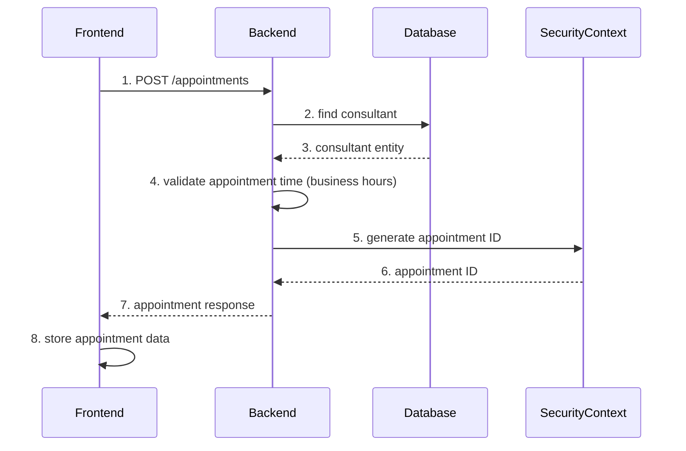
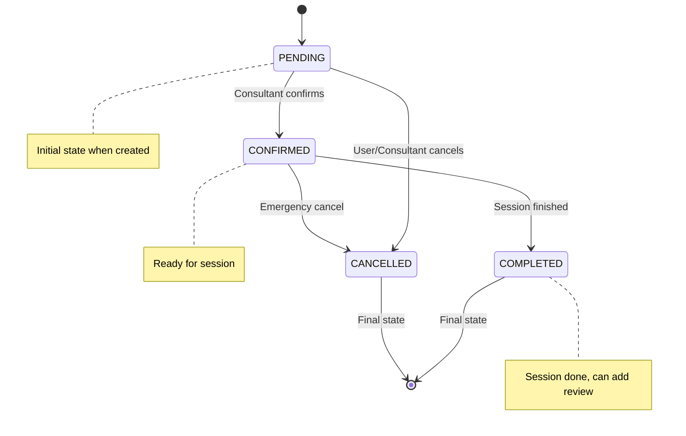
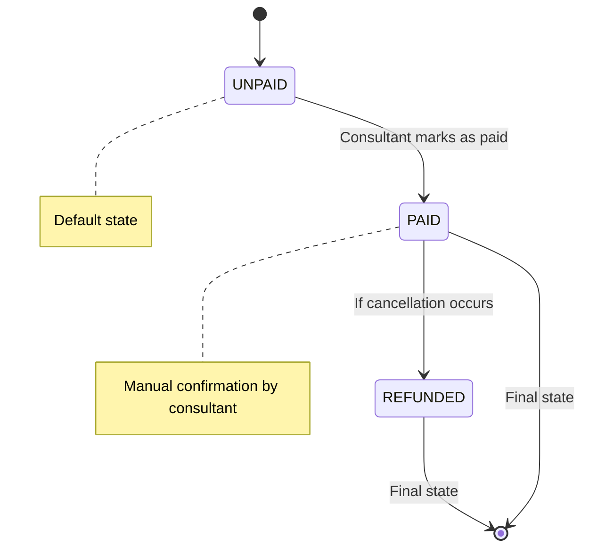
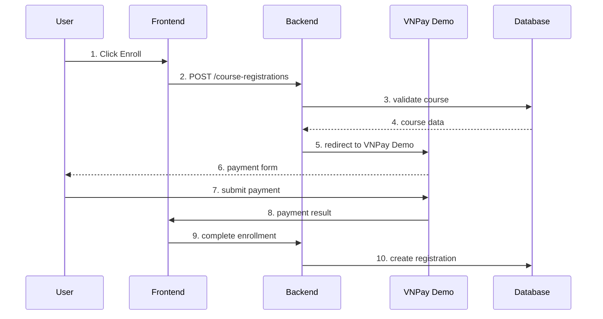
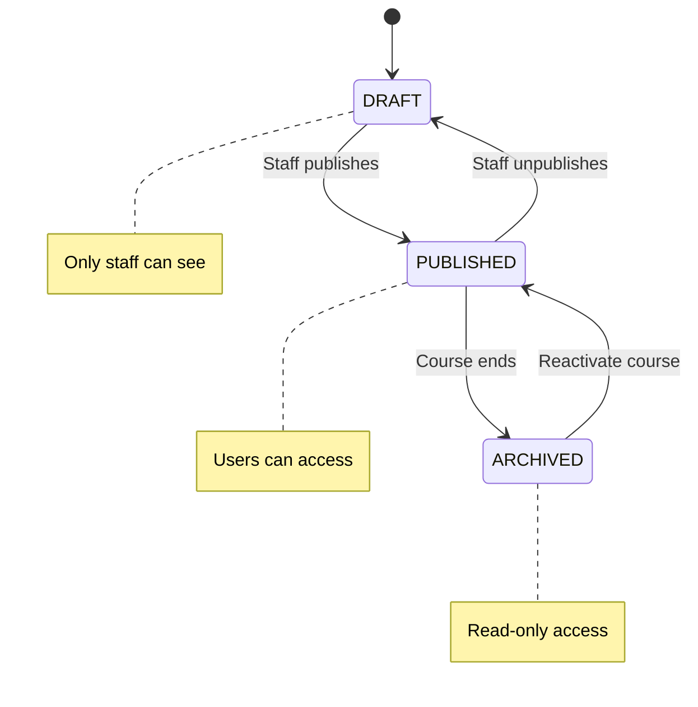
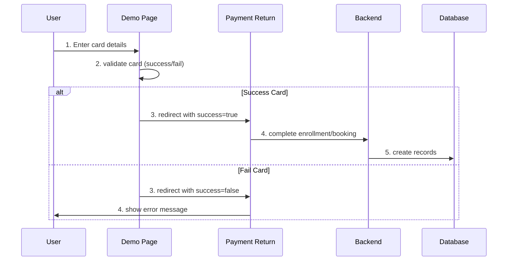
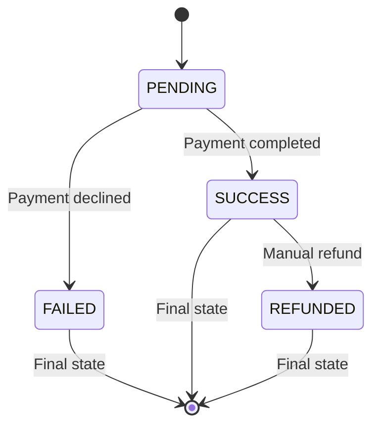
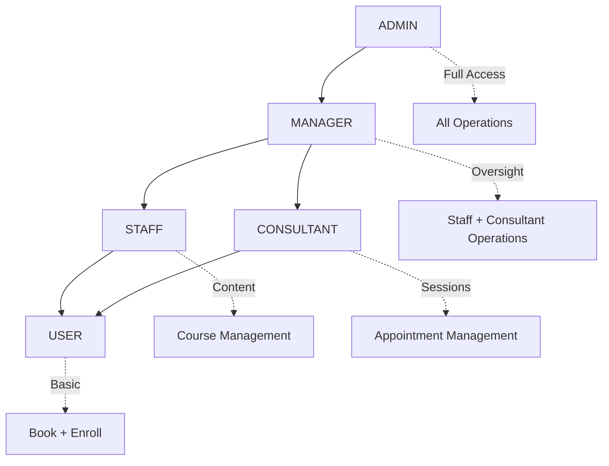

# 🏥 APPOINTMENT & COURSE SYSTEM FLOWS
**Drug Use Prevention Support System - Complete Logic Documentation**

---

## 📋 **TABLE OF CONTENTS**

1. [System Overview](#system-overview)
2. [Appointment Booking System](#appointment-booking-system)
3. [Course Management System](#course-management-system)
4. [Payment Processing](#payment-processing)
5. [User Roles & Permissions](#user-roles--permissions)
6. [Database Schema](#database-schema)
7. [File Locations & Methods](#file-locations--methods)

---

## 🎯 **SYSTEM OVERVIEW**

### **Core Features**
- **Appointment Booking:** Direct consultation scheduling (no payment required)
- **Course Management:** Enrollment with VNPay payment integration
- **Multi-Role Support:** User, Consultant, Staff, Admin, Manager
- **Payment Processing:** VNPay integration with demo mode

### **Architecture**
```
Frontend (React + Ant Design)
    ↓
Backend (Spring Boot + JWT)
    ↓
Database (SQL Server)
    ↓
External Services (VNPay Gateway)
```

---

## 📅 **APPOINTMENT BOOKING SYSTEM**

### **🔄 APPOINTMENT BOOKING SEQUENCE**



### **📊 APPOINTMENT MANAGEMENT STATES**



### **💰 PAYMENT STATUS FLOW**



---

## 📚 **COURSE MANAGEMENT SYSTEM**

### **🔄 COURSE ENROLLMENT SEQUENCE**



### **📊 COURSE CONTENT STATES**



---

## 💳 **PAYMENT PROCESSING**

### **🔄 VNPAY DEMO SEQUENCE**



### **💰 PAYMENT STATES**



---

## 👤 **USER ROLES & PERMISSIONS**

### **🔐 ROLE HIERARCHY**



### **📊 PERMISSION MATRIX**

| Action | USER | CONSULTANT | STAFF | MANAGER | ADMIN |
|--------|------|------------|-------|---------|--------|
| Book Appointment | ✅ | ❌ | ❌ | ❌ | ✅ |
| Confirm Appointment | ❌ | ✅ | ❌ | ❌ | ✅ |
| Create Course | ❌ | ❌ | ✅ | ✅ | ✅ |
| Enroll in Course | ✅ | ✅ | ✅ | ✅ | ✅ |
| Manage Users | ❌ | ❌ | ❌ | ✅ | ✅ |

---

## 🗄️ **DATABASE SCHEMA**

### **📅 APPOINTMENTS TABLE**

```sql
appointments
├── id (Primary Key)
├── client_id (Foreign Key → users.id)
├── consultant_id (Foreign Key → users.id)
├── appointment_date (DateTime)
├── status ('PENDING', 'CONFIRMED', 'COMPLETED', 'CANCELLED')
├── payment_status ('UNPAID', 'PAID', 'REFUNDED')
├── fee (Decimal)
└── created_at (DateTime)
```

### **📚 COURSES SYSTEM**

```sql
courses
├── id (Primary Key)
├── title (String)
├── price (Decimal)
└── published (Boolean)

course_registrations
├── course_id (Foreign Key)
├── user_id (Foreign Key)
├── status ('ACTIVE', 'INACTIVE')
└── registration_date (DateTime)

payments
├── id (Primary Key)
├── user_id (Foreign Key)
├── amount (Decimal)
├── status ('PENDING', 'SUCCESS', 'FAILED')
└── transaction_id (String)
```

---

## 📁 **FILE LOCATIONS & METHODS**

### **📅 APPOINTMENT SYSTEM FILES**

#### **Frontend Files:**
```
📂 frontend/src/pages/
├── AppointmentPage.jsx
│   ├── loadConsultants()
│   ├── handleBookingSubmit()
│   └── handleDateChange()
├── dashboards/ConsultantDashboard.jsx
│   ├── handleConfirmAppointment()
│   ├── handleMarkAsPaid()
│   └── handleCancelAppointment()
└── AppointmentListPage.jsx
    └── loadUserAppointments()

📂 frontend/src/services/
└── appointmentService.js
    ├── createAppointmentWithPayment()
    ├── getAppointmentsByClient()
    └── getAppointmentsByConsultant()
```

#### **Backend Files:**
```
📂 backend/src/main/java/com/drugprevention/drugbe/
├── controller/AppointmentController.java
│   ├── createAppointment() → POST /api/appointments
│   ├── confirmAppointment() → PUT /api/appointments/{id}/confirm
│   └── markAppointmentAsPaid() → PUT /api/appointments/{id}/mark-paid
├── service/AppointmentService.java
│   ├── createAppointment()
│   ├── validateAppointmentDateTime()
│   └── markAppointmentAsPaid()
├── dto/CreateAppointmentRequest.java
│   └── validation annotations
└── repository/AppointmentRepository.java
    ├── findByClientIdOrderByAppointmentDateDesc()
    └── findConflictingAppointments()
```

### **📚 COURSE SYSTEM FILES**

#### **Frontend Files:**
```
📂 frontend/src/pages/
├── CoursesPage.jsx
│   ├── loadCourses()
│   └── handleEnroll()
├── CoursePage.jsx
│   ├── loadCourseContent()
│   └── renderContent()
├── StaffCourseManagementPage.jsx
│   ├── handleCreateCourse()
│   └── handlePublishCourse()
└── VnPayDemoPage.jsx
    ├── handlePaymentSubmit()
    └── fillTestCard()

📂 frontend/src/services/
├── courseService.js
│   ├── enrollInCourse()
│   ├── getAllCourses()
│   └── completeEnrollmentAfterPayment()
└── paymentService.js
    └── createCoursePayment()
```

#### **Backend Files:**
```
📂 backend/src/main/java/com/drugprevention/drugbe/
├── controller/
│   ├── CourseController.java
│   │   ├── getAllCourses() → GET /api/courses
│   │   └── getLessonContent() → GET /api/courses/{id}/lessons/{lessonId}/content
│   ├── CourseRegistrationController.java
│   │   └── registerCourse() → POST /api/course-registrations
│   └── StaffCourseControllerSimple.java
│       ├── createCourse() → POST /api/staff/courses
│       └── createContent() → POST /api/staff/courses/{id}/lessons/{lessonId}/content
├── service/
│   ├── CourseService.java
│   │   ├── getAllCoursesForUser()
│   │   └── completeEnrollmentAfterPayment()
│   ├── CourseRegistrationService.java
│   │   └── createCoursePayment()
│   └── CourseContentService.java
│       ├── createContent()
│       └── getPublishedContentByLesson()
└── repository/
    ├── CourseRepository.java
    ├── CourseRegistrationRepository.java
    └── CourseContentRepository.java
```

### **💳 PAYMENT SYSTEM FILES**

#### **Frontend Files:**
```
📂 frontend/src/pages/
├── VnPayDemoPage.jsx
│   ├── handlePaymentSubmit()
│   └── testCards[] (success/fail cards)
└── PaymentReturnPage.jsx
    ├── processPaymentReturn()
    └── completeEnrollment()

📂 frontend/src/services/
└── paymentService.js
    ├── createCoursePayment()
    └── useVnPayDemo = true
```

#### **Backend Files:**
```
📂 backend/src/main/java/com/drugprevention/drugbe/
├── controller/PaymentController.java
│   ├── createCoursePayment() → POST /api/payments/course/create
│   └── createAppointmentPayment() → POST /api/payments/appointment/create
├── service/
│   ├── PaymentService.java
│   │   └── createCoursePayment()
│   └── VnPayService.java
│       ├── createPaymentUrl()
│       └── verifyPaymentSignature()
├── config/VnPayConfig.java
│   ├── tmnCode
│   ├── hashSecret
│   └── vnpUrl
└── entity/Payment.java
    ├── status
    ├── amount
    └── transactionId
```

---

## ⚡ **BUSINESS RULES**

### **📅 APPOINTMENT RULES**

1. **Time Constraints:**
   - Working hours: 8:00 AM - 6:00 PM
   - Weekdays only (Monday - Friday)  
   - Fixed 60-minute duration
   - Maximum 30 days advance booking

2. **Status Flow:**
   ```
   PENDING → CONFIRMED → COMPLETED
        ↓
   CANCELLED (from any state)
   ```

3. **Payment:**
   - Default: UNPAID
   - Consultant manually marks as PAID

### **📚 COURSE RULES**

1. **Content Access:**
   - Must be enrolled + content published
   - Staff see all content
   - Users see published only

2. **Enrollment:**
   - Requires VNPay payment
   - One-time payment per course
   - Immediate access after success

---

## 🚨 **COMMON ERRORS & SOLUTIONS**

### **📅 Appointment Errors**
- `"Working hours are from 8:00 AM to 6:00 PM"` → **File:** `AppointmentService.java` → **Method:** `validateAppointmentDateTime()`
- `"Cannot schedule appointments on weekends"` → **File:** `AppointmentService.java` → **Method:** `validateAppointmentDateTime()`
- `"Consultant is not available at this time"` → **File:** `AppointmentService.java` → **Method:** `checkForConflicts()`

### **📚 Course Errors**  
- `"You are already enrolled in this course"` → **File:** `CourseRegistrationService.java` → **Method:** `createCoursePayment()`
- `"Course is not available for enrollment"` → **File:** `CourseRegistrationService.java` → **Method:** `createCoursePayment()`
- `"You must be enrolled to access this content"` → **File:** `CourseController.java` → **Method:** `getLessonContentForUser()`

### **💳 Payment Errors**
- `"Thanh toán thất bại - Thẻ không đủ số dư"` → **File:** `VnPayDemoPage.jsx` → **Method:** `handlePaymentSubmit()`
- `"Payment URL not received"` → **File:** `PaymentService.java` → **Method:** `createCoursePayment()`

---

## 🧪 **TEST CARDS**

### **VNPay Demo Cards:**
- **Success Card:** `9704198526191432198`
- **Failed Card:** `9704195798459170488`
- **Card Holder:** `NGUYEN VAN A`
- **Expiry:** `07/15`
- **CVV:** `123`

---

## 🔍 **DEBUG LOCATIONS**

### **Frontend Debug Points:**
- **AppointmentPage.jsx:** `console.log('📅 Booking appointment:', appointmentData)`
- **CoursesPage.jsx:** `console.log('🎓 Starting enrollment for course:', course.id)`
- **VnPayDemoPage.jsx:** `console.log('✅ SUCCESS - Navigating to success page')`

### **Backend Debug Points:**
- **AppointmentController.java:** `System.out.println("📝 Creating appointment: " + request)`
- **CourseService.java:** `System.out.println("🎓 Creating course enrollment")`
- **PaymentService.java:** `System.out.println("💳 Creating VNPay payment URL")`

---

**📝 Documentation Updated:** January 2025  
**⚡ System Status:** Production Ready  
**🔧 Last Modified:** Simplified Diagrams & File Locations  

---

*Hệ thống đặt lịch và khóa học với các diagrams và file locations đơn giản, dễ hiểu cho developers.* 