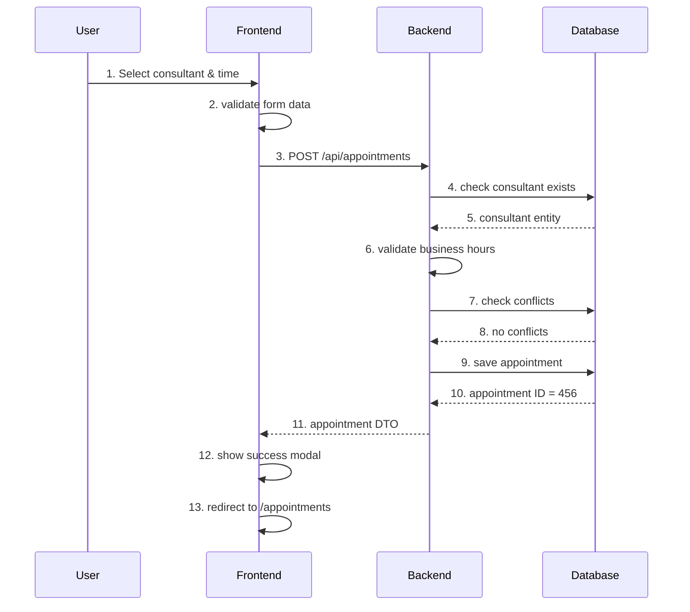
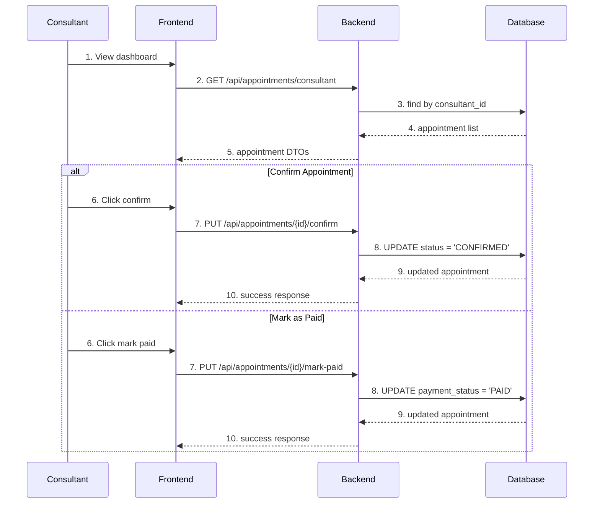
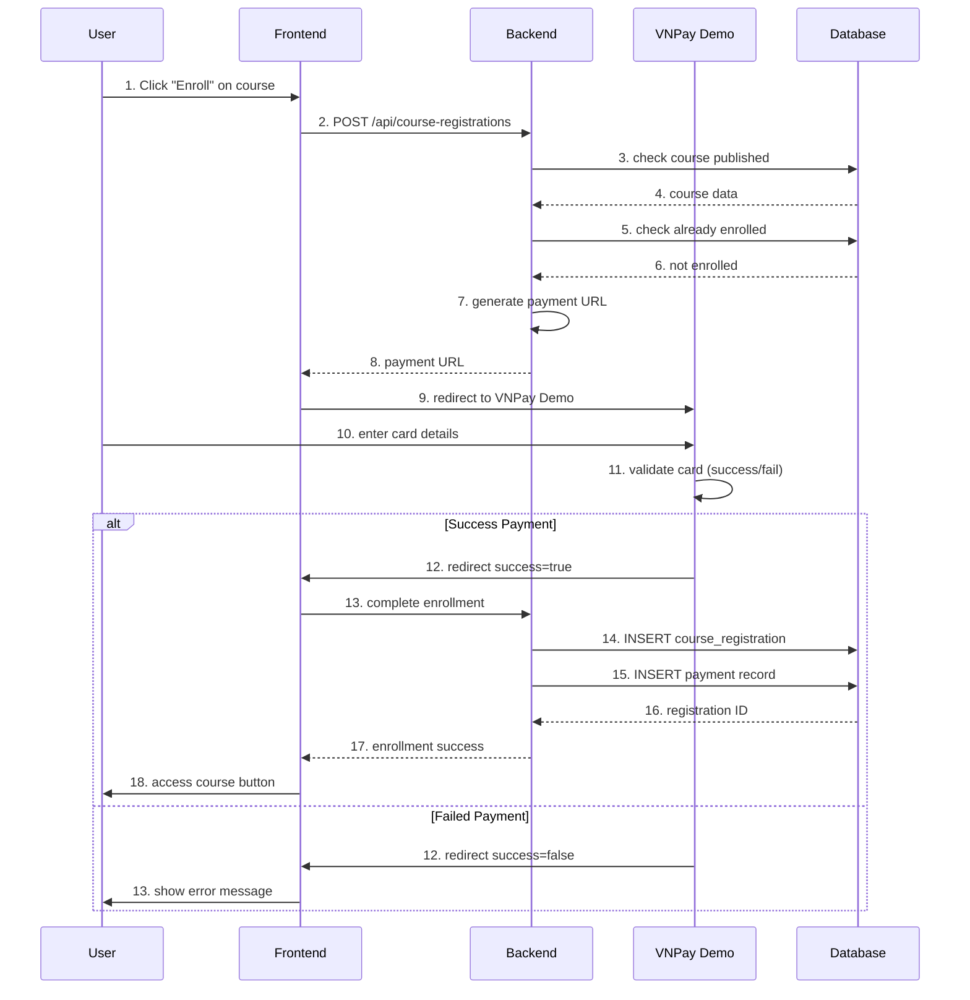
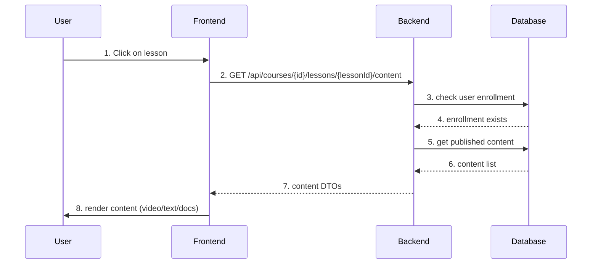

# 🚀 DEVELOPER GUIDE - APPOINTMENT & COURSE FLOWS
**Chi tiết luồng hoạt động, API calls, DTOs và Backend Logic**

---

## 📋 **TABLE OF CONTENTS**

1. [Appointment Booking Flow](#appointment-booking-flow)
2. [Course Enrollment Flow](#course-enrollment-flow) 
3. [API Reference & Examples](#api-reference--examples)
4. [File Locations & Method Calls](#file-locations--method-calls)
5. [Database Operations](#database-operations)
6. [Testing & Debug Guide](#testing--debug-guide)

---

## 📅 **APPOINTMENT BOOKING FLOW**

### **🔄 APPOINTMENT BOOKING SEQUENCE**



### **📊 CONSULTANT APPOINTMENT MANAGEMENT**



---

## 📚 **COURSE ENROLLMENT FLOW**

### **🔄 COURSE ENROLLMENT SEQUENCE**



### **📊 COURSE CONTENT ACCESS**



---

## 🔗 **API REFERENCE & EXAMPLES**

### **📅 APPOINTMENT APIs**

| Method | Endpoint | Description | File Location |
|--------|----------|-------------|---------------|
| POST | `/api/appointments` | Create appointment | `AppointmentController.java` |
| PUT | `/api/appointments/{id}/confirm` | Confirm appointment | `AppointmentController.java` |
| PUT | `/api/appointments/{id}/mark-paid` | Mark as paid | `AppointmentController.java` |
| GET | `/api/appointments/client/{id}` | Get user appointments | `AppointmentController.java` |
| GET | `/api/appointments/consultant/{id}` | Get consultant appointments | `AppointmentController.java` |

### **📚 COURSE APIs**

| Method | Endpoint | Description | File Location |
|--------|----------|-------------|---------------|
| GET | `/api/courses` | Get published courses | `CourseController.java` |
| POST | `/api/course-registrations` | Enroll in course | `CourseRegistrationController.java` |
| GET | `/api/courses/{id}/lessons/{lessonId}/content` | Get lesson content | `CourseController.java` |
| POST | `/api/staff/courses` | Create course (staff) | `StaffCourseControllerSimple.java` |
| POST | `/api/staff/courses/{id}/lessons/{lessonId}/content` | Add content (staff) | `StaffCourseControllerSimple.java` |

### **💳 PAYMENT APIs**

| Method | Endpoint | Description | File Location |
|--------|----------|-------------|---------------|
| POST | `/api/payments/course/create` | Create course payment | `PaymentController.java` |
| GET | `/payment/return` | VNPay return URL | `PaymentReturnPage.jsx` |

---

## 📁 **FILE LOCATIONS & METHOD CALLS**

### **📅 APPOINTMENT SYSTEM**

#### **Frontend Files & Methods:**

```
📂 frontend/src/pages/AppointmentPage.jsx
├── loadConsultants() 
│   └── api.get('/consultants')
├── handleBookingSubmit()
│   └── appointmentService.createAppointmentWithPayment()
└── handleDateChange()
    └── Generate time slots 9-17h

📂 frontend/src/pages/dashboards/ConsultantDashboard.jsx  
├── loadDashboardData()
│   └── api.get('/appointments/consultant')
├── handleConfirmAppointment()
│   └── api.put('/appointments/{id}/confirm')
├── handleMarkAsPaid()
│   └── api.put('/appointments/{id}/mark-paid')
└── handleCancelAppointment()
    └── api.put('/appointments/{id}/cancel')

📂 frontend/src/services/appointmentService.js
├── createAppointmentWithPayment()
│   └── api.post('/appointments', requestData)
├── getAppointmentsByClient()
│   └── api.get('/appointments/client/{id}')
└── getAppointmentsByConsultant()
    └── api.get('/appointments/consultant/{id}')
```

#### **Backend Files & Methods:**

```
📂 backend/.../controller/AppointmentController.java
├── createAppointment()
│   └── appointmentService.createAppointment(request)
├── confirmAppointment()
│   └── appointmentService.confirmAppointment(id, consultantId)
├── markAppointmentAsPaid()
│   └── appointmentService.markAppointmentAsPaid(id, consultantId)
└── getAppointmentsByClient()
    └── appointmentService.getAppointmentsByClient(clientId)

📂 backend/.../service/AppointmentService.java
├── createAppointment()
│   ├── validateCreateAppointmentRequest()
│   ├── validateAppointmentDateTime()
│   ├── checkForConflicts()
│   └── appointmentRepository.save()
├── confirmAppointment()
│   └── appointment.setStatus("CONFIRMED")
└── markAppointmentAsPaid()
    └── appointment.setPaymentStatus("PAID")

📂 backend/.../repository/AppointmentRepository.java
├── findByClientIdOrderByAppointmentDateDesc()
├── findByConsultantIdOrderByAppointmentDateDesc()
└── findConflictingAppointments()
```

### **📚 COURSE SYSTEM**

#### **Frontend Files & Methods:**

```
📂 frontend/src/pages/CoursesPage.jsx
├── loadCourses()
│   └── courseService.getAllCourses()
├── handleEnroll()
│   └── courseService.enrollInCourse(courseId)
└── loadUserEnrollments()
    └── courseService.getUserEnrollments()

📂 frontend/src/pages/CoursePage.jsx
├── loadCourse()
│   └── courseService.getCourseById(id)
├── loadLessons()
│   └── courseService.getCourseLessons(courseId)
└── loadLessonContent()
    └── courseService.getLessonContent(courseId, lessonId)

📂 frontend/src/pages/StaffCourseManagementPage.jsx
├── handleCreateCourse()
│   └── api.post('/staff/courses', courseData)
├── handlePublishCourse()
│   └── api.put('/staff/courses/{id}', {published: true})
└── loadStaffCourses()
    └── api.get('/staff/courses')

📂 frontend/src/services/courseService.js
├── enrollInCourse()
│   └── api.post('/course-registrations', {courseId, userId})
├── getAllCourses()
│   └── api.get('/courses')
├── completeEnrollmentAfterPayment()
│   └── api.post('/courses/{id}/complete-enrollment')
└── getLessonContent()
    └── api.get('/courses/{id}/lessons/{lessonId}/content')
```

#### **Backend Files & Methods:**

```
📂 backend/.../controller/CourseController.java
├── getAllCourses()
│   └── courseService.getAllCoursesForUser(userId)
├── getCourseById()
│   └── courseService.getCourseById(id)
└── getLessonContentForUser()
    └── courseContentService.getPublishedContentByLesson()

📂 backend/.../controller/CourseRegistrationController.java
├── registerCourse()
│   └── courseRegistrationService.createCoursePayment()
└── completeEnrollment()
    └── courseService.completeEnrollmentAfterPayment()

📂 backend/.../service/CourseService.java
├── getAllCoursesForUser()
│   ├── courseRepository.findPublishedCourses()
│   └── checkUserEnrollments()
├── completeEnrollmentAfterPayment()
│   ├── courseRegistrationRepository.save()
│   └── paymentRepository.save()
└── getCourseById()
    └── courseRepository.findById()

📂 backend/.../service/CourseRegistrationService.java
├── createCoursePayment()
│   ├── validateCourse()
│   ├── checkExistingEnrollment()
│   └── paymentService.createCoursePayment()
└── processEnrollment()
    └── courseRegistrationRepository.save()
```

### **💳 PAYMENT SYSTEM**

#### **Frontend Files & Methods:**

```
📂 frontend/src/pages/VnPayDemoPage.jsx
├── handlePaymentSubmit()
│   ├── validateCard()
│   └── navigate('/payment/return?success=true/false')
├── fillTestCard()
│   └── form.setFieldsValue()
└── testCards[]
    ├── Success: 9704198526191432198
    └── Failed: 9704195798459170488

📂 frontend/src/pages/PaymentReturnPage.jsx
├── processPaymentReturn()
│   ├── parseUrlParams()
│   └── completeEnrollment()
├── handleCourseEnrollment()
│   └── courseService.completeEnrollmentAfterPayment()
└── handlePaymentSuccess()
    └── navigate('/courses/{id}')

📂 frontend/src/services/paymentService.js
├── createCoursePayment()
│   └── api.post('/payments/course/create')
└── useVnPayDemo = true
```

#### **Backend Files & Methods:**

```
📂 backend/.../controller/PaymentController.java
├── createCoursePayment()
│   └── paymentService.createCoursePayment()
├── createAppointmentPayment()
│   └── paymentService.createAppointmentPayment()
└── handleVnPayReturn()
    └── vnPayService.verifyPaymentSignature()

📂 backend/.../service/PaymentService.java
├── createCoursePayment()
│   ├── validatePaymentRequest()
│   ├── vnPayService.createPaymentUrl()
│   └── paymentRepository.save()
└── processPaymentReturn()
    ├── vnPayService.verifySignature()
    └── updatePaymentStatus()

📂 backend/.../service/VnPayService.java
├── createPaymentUrl()
│   ├── buildVnPayParams()
│   ├── generateSecureHash()
│   └── buildPaymentUrl()
└── verifyPaymentSignature()
    └── validateHmacSha512()

📂 backend/.../config/VnPayConfig.java
├── tmnCode = "2QXUI4J4"
├── hashSecret = "SNPJOXZWBGTKSJRRMGFNKRFQPJGMRFGJ"
└── vnpUrl = "https://sandbox.vnpayment.vn/paymentv2/vpcpay.html"
```

---

## 🗄️ **DATABASE OPERATIONS**

### **📅 APPOINTMENT TABLES**

```sql
-- Create appointment
INSERT INTO appointments (client_id, consultant_id, appointment_date, status, payment_status) 
VALUES (123, 14, '2025-08-01 09:00:00', 'PENDING', 'UNPAID');

-- Update appointment status
UPDATE appointments SET status = 'CONFIRMED' WHERE id = 456;

-- Update payment status  
UPDATE appointments SET payment_status = 'PAID' WHERE id = 456;

-- Check conflicts
SELECT * FROM appointments 
WHERE consultant_id = 14 
AND appointment_date BETWEEN '2025-08-01 09:00:00' AND '2025-08-01 10:00:00'
AND status != 'CANCELLED';
```

### **📚 COURSE TABLES**

```sql
-- Get published courses
SELECT * FROM courses WHERE published = 1;

-- Create course registration
INSERT INTO course_registrations (course_id, user_id, status, registration_date) 
VALUES (15, 123, 'ACTIVE', GETDATE());

-- Create payment record
INSERT INTO payments (user_id, amount, status, transaction_id, description) 
VALUES (123, 190000, 'SUCCESS', 'DEMO_123456', 'Enrollment for Course ABC');

-- Check user enrollment
SELECT * FROM course_registrations 
WHERE course_id = 15 AND user_id = 123 AND status = 'ACTIVE';
```

---

## 🧪 **TESTING & DEBUG GUIDE**

### **📅 APPOINTMENT TESTING**

#### **Test Scenarios:**
```javascript
// Test 1: Successful booking
1. User: Select consultant ID 14
2. User: Select tomorrow 9:00 AM  
3. User: Submit form
4. Expected: Appointment created with status PENDING
5. Check: Database has new record

// Test 2: Weekend booking error
1. User: Select Saturday date
2. Expected: Error "Cannot schedule appointments on weekends"
3. File: AppointmentService.java → validateAppointmentDateTime()

// Test 3: Consultant conflict
1. User: Select time slot already booked
2. Expected: Error "Consultant is not available at this time"  
3. File: AppointmentService.java → findConflictingAppointments()
```

#### **Debug Points:**
```javascript
// Frontend Debug
console.log('📅 Booking appointment:', appointmentData);
// File: AppointmentPage.jsx → handleBookingSubmit()

console.log('✅ Appointment created:', result.data);
// File: appointmentService.js → createAppointmentWithPayment()

// Backend Debug
System.out.println("📝 Creating appointment: " + request);
// File: AppointmentController.java → createAppointment()

System.out.println("🔍 Validating time: " + appointmentDate);
// File: AppointmentService.java → validateAppointmentDateTime()
```

### **📚 COURSE TESTING**

#### **Test Scenarios:**
```javascript
// Test 1: Successful enrollment
1. User: Click "Enroll" on course ID 15
2. User: Redirect to VNPay Demo
3. User: Enter success card 9704198526191432198
4. Expected: Payment success → enrollment created
5. Check: course_registrations table has new record

// Test 2: Failed payment
1. User: Enter failed card 9704195798459170488
2. Expected: "Thanh toán thất bại - Thẻ không đủ số dư"
3. Check: No enrollment created

// Test 3: Already enrolled
1. Enrolled user: Click "Enroll" again
2. Expected: Error "You are already enrolled in this course"
3. File: CourseRegistrationService.java → createCoursePayment()
```

#### **Debug Points:**
```javascript
// Frontend Debug
console.log('🎓 Starting enrollment:', course.id);
// File: CoursesPage.jsx → handleEnroll()

console.log('💳 Payment URL:', result.data.paymentUrl);
// File: courseService.js → enrollInCourse()

// Backend Debug  
System.out.println("🎓 Creating course enrollment for user: " + userId);
// File: CourseRegistrationService.java → createCoursePayment()

System.out.println("📋 Course validation passed: " + course.getTitle());
// File: CourseService.java → validateCourse()
```

### **💳 PAYMENT TESTING**

#### **VNPay Demo Test Cards:**
```javascript
// Success Card
cardNumber: '9704198526191432198'
cardHolder: 'NGUYEN VAN A'
expiry: '07/15'
cvv: '123'
// Expected: Navigate to success page

// Failed Card  
cardNumber: '9704195798459170488'
cardHolder: 'NGUYEN VAN A'
expiry: '07/15' 
cvv: '123'
// Expected: Navigate to failed page
```

#### **Debug Points:**
```javascript
// Frontend Debug
console.log('✅ SUCCESS - Navigating to success page');
console.log('❌ FAILED - Navigating to fail page');
// File: VnPayDemoPage.jsx → handlePaymentSubmit()

console.log('🎓 Completing enrollment for demo payment');
// File: PaymentReturnPage.jsx → processPaymentReturn()

// Backend Debug
System.out.println("💳 Creating VNPay payment URL for amount: " + amount);
// File: PaymentService.java → createCoursePayment()

System.out.println("🔐 VNPay signature verified successfully");
// File: VnPayService.java → verifyPaymentSignature()
```

### **🔍 DATABASE DEBUG QUERIES**

```sql
-- Check recent appointments
SELECT TOP 5 * FROM appointments ORDER BY created_at DESC;

-- Check course enrollments
SELECT cr.*, c.title FROM course_registrations cr
JOIN courses c ON cr.course_id = c.id
ORDER BY cr.registration_date DESC;

-- Check payment status
SELECT TOP 5 * FROM payments ORDER BY created_at DESC;

-- Check consultant availability
SELECT * FROM appointments 
WHERE consultant_id = 14 
AND appointment_date >= GETDATE()
AND status NOT IN ('CANCELLED')
ORDER BY appointment_date;
```

---

**📝 Developer Guide Updated:** January 2025  
**🎯 Target Audience:** Full-stack Developers  
**🔧 Last Modified:** Simplified with Sequence Diagrams & File Locations  

---

*Hướng dẫn developer với sequence diagrams và file locations chi tiết, dễ hiểu cho việc implement và debug hệ thống đặt lịch và khóa học.* 